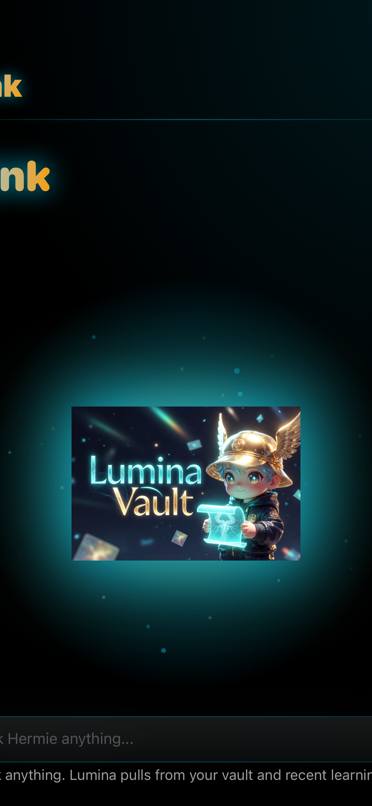
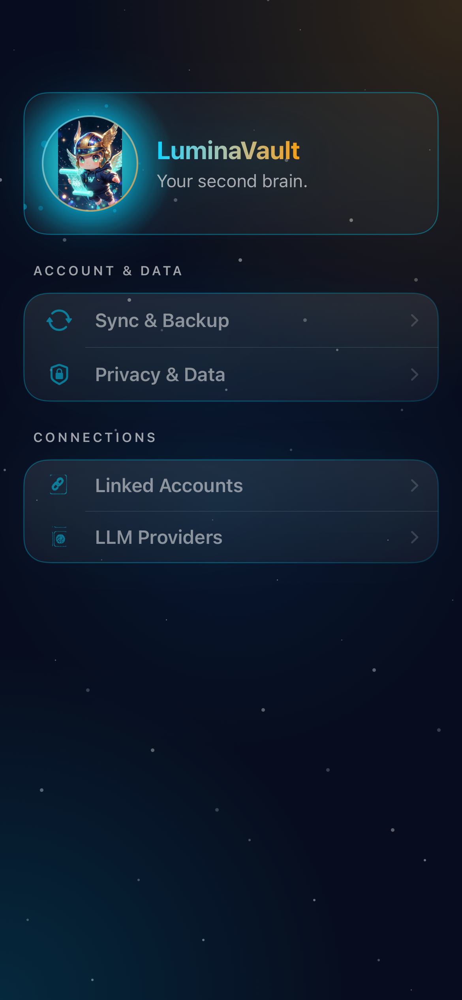
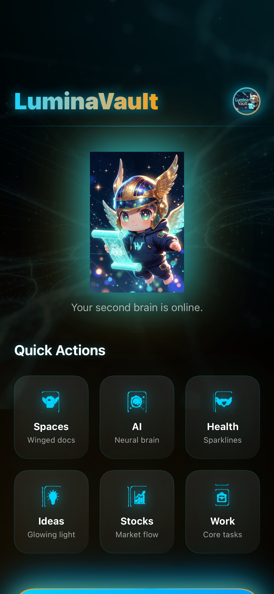
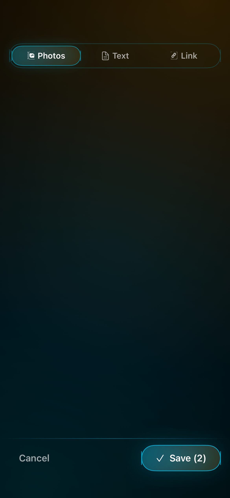
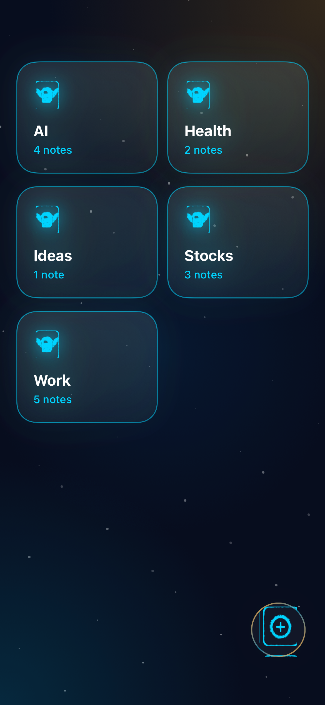
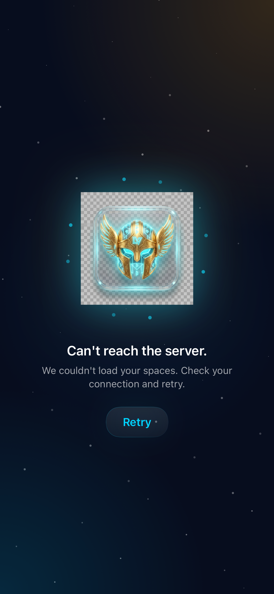

# HER-299 Redesign Audit — does the iOS app respect each subtask's design constraints + screenshots?

**Date:** 2026-05-28 · **Branch:** `main` (incl. PRs #96–#102, #104) · **Reviewer:** Claude

## What this checks

[HER-299 "Redesign app"](https://linear.app/luminavault/issue/HER-299) spawned 9 subtasks to turn LuminaVault iOS into a premium sci-fi look (dark cosmic theme, **cyan `#00F0FF` + gold `#FFD700`** accents, glassmorphism, volumetric glows, particles, custom icons over SF Symbols, strong mascot presence). All 9 are now **Done** and merged to `main`.

This audit verifies the shipped code against (a) each ticket's written **design constraints** and (b) its **reference screenshot**, using two evidence streams:

- **Code** — design-token usage in the screen's SwiftUI (`file:line`).
- **Visual** — current render captured via `swift-snapshot-testing` on iPhone 16 Pro, dark mode, compared to the Linear reference.

### Method caveats (read before trusting a "blank" render)

1. **Rive-backed `HermieMascotView` heroes render blank in headless snapshots.** The Home mascot hero and the GetStarted mascot show as empty space in captures, while *static asset* art (empty-state crest, tab/icon glyphs, settings halo) renders fine. So mascot **heroes** could not be visually confirmed here and need an on-device check — this is a capture limitation, not proof of a bug.
2. **GetStarted content is opacity-gated by an intro animation** that is disabled in snapshots → its capture is inconclusive; verdict rests on code.
3. **Think (`ChatView`) was not rendered** — its view models need `Conversations`/`Chat`/`Memory` clients with no existing test mocks. Verdict rests on code, which matches the reference closely.
4. Transparent-PNG sub-frames show a checkerboard in captures (snapshot renders alpha as checkerboard); on device they sit over the dark background.

> **Update 2026-05-28 — gaps filled.** Functional defects fixed and locked with snapshot
> coverage. See **[Gap resolution](#gap-resolution-2026-05-28)** below. Verdicts in the table
> reflect the post-fix state.

## Summary

| Subtask | Screen | Verdict | Headline |
|---|---|---|---|
| [HER-300](https://linear.app/luminavault/issue/HER-300) | a) design system | ✅ PASS | Full token system shipped: theme, glass, glow, aurora, particles, halo, pulse, mascot |
| [HER-301](https://linear.app/luminavault/issue/HER-301) | b) icon system | ✅ PASS | `LVIcon` + `Lumina/Tab/*` & `Lumina/Icons/*` branded glyphs; SF Symbols are fallback-only |
| [HER-302](https://linear.app/luminavault/issue/HER-302) | h) Think | ✅ PASS | Halo+sparkle mascot hero, glass bubbles, glowing composer; now snapshot-covered |
| [HER-303](https://linear.app/luminavault/issue/HER-303) | g) Settings | ✅ PASS | Glass hero band (mascot now renders) + grouped glowing rows |
| [HER-304](https://linear.app/luminavault/issue/HER-304) | f) Home | ✅ PASS | Wordmark, mascot hero (fixed), 6 glass brand-glyph cards, gold-ring CTA, particles |
| [HER-305](https://linear.app/luminavault/issue/HER-305) | e) Capture sheet | ✅ PASS | Aurora + glass mode tabs (Photos/Text/Link) + glowing Cancel/Save toolbar + gold-ring FAB |
| [HER-306](https://linear.app/luminavault/issue/HER-306) | d) Onboarding | ✅ PASS | Reference copy adopted ("Your Knowledge, Transcended" / "Begin Journey") |
| [HER-307](https://linear.app/luminavault/issue/HER-307) | c) Spaces | ✅ PASS | Glass grid cards (brighter cyan glow stroke now), brand glyphs, gold-ring `LVFAB`, mascot states |
| HER-299 body | Tab bar + FAB | ☑️ ACCEPTED | Glow active tab + pulse + glass + glowing FAB; tab set (extra "Reflect", Settings in More) kept as intentional product IA |

---

## Gap resolution (2026-05-28)

| Gap | Fix | Status |
|---|---|---|
| **Mascot hero blank (Home + Settings)** — `Image("hermie-hero")` failed because the asset is namespaced `Lumina/Mascot/hermie-hero` (folders set `provides-namespace: true`). A real on-device defect. | `fallbackImageName` → `"Lumina/Mascot/hermie-hero"` at `HomeView.swift:220` and `SettingsHeroBand.swift:58`. | ✅ Fixed; re-recorded Home + Settings snapshots show the mascot. |
| **Onboarding copy (HER-306)** | `GetStartedView.swift`: headline → "Your Knowledge, Transcended", CTA → "Begin Journey". | ✅ Done. |
| **Spaces card glow too muted (HER-307)** | Added `.lvGlowStroke(cornerRadius: 24, intensity: LVGlow.card)` after `lvGlassCard` in `SpaceCardView.swift`. | ✅ Done; cards now show a bright cyan border. |
| **Tab IA divergence** (extra "Reflect", Settings in More) | Reviewed — **kept** as intentional post-redesign product IA (HER-194/HER-243). | ☑️ Accepted, no code change. |
| **Settings avatar** (mascot disc vs winged-helmet crest) | Reviewed — **kept** the mascot disc. | ☑️ Accepted, no code change. |
| **Snapshot coverage gap** | Added `RedesignChromeSnapshotTests` (Spaces grid, Settings hero, Capture chrome, Think empty hero) + re-recorded `HomeViewSnapshotTests`. | ✅ Done; all suites green on iPhone 16 Pro. |

Note: the GetStarted hero (`GetStartedHero`, non-namespaced `Onboarding/`) and all
`OnboardingMascot` call sites were **never** broken — only the namespaced `hermie-hero`
reference was. GetStarted's blank capture was an opacity-gated intro-animation artifact.

Current renders below reflect the post-fix state.

---

## HER-300 — Design system direction ✅

**Spec:** consistent palette (cyan/gold), typography, glassmorphic cards, button styles, empty/error states, glows, particles, mascot.

**Evidence (code):** all four token tiers + cinematic modifiers exist and are used app-wide:
- `Utilities/LVTheme.swift` (`LVThemeManager`, default theme `.cyanGold`), `Utilities/LVPalette.swift`, `LVTypography.swift`, `LVSpacing.swift`, `LVGlow.swift` (named intensities).
- Modifiers: `Utilities/Extensions/View+LVGlass.swift:11` `lvGlassCard`, `:16` `lvGlowStroke`, `:27` `lvAuroraGoldRing`, `:34` `lvInnerGlow`; `View+LVParticleBackground.swift:28` `lvParticleBackground`; `View+LVPulse.swift:8` `lvPulse`.
- Cinematic surfaces: `Components/LVHaloBackdrop.swift`, `Components/HermieMascotView.swift`, `SparkleField`, `Components/LVEmptyState.swift`, `Components/LVButton.swift`, `Components/LVFAB.swift`.

**Verdict:** PASS. The design system the other tickets depend on is fully present and consumed.

## HER-301 — Icon system ✅

**Spec:** drop generic SF Symbols; cohesive glowing futuristic icon set (Home, Spaces, Think, Visual Search, Settings + prominent + button) in the mascot universe.

**Evidence:** `Utilities/LVIcon.swift` is a semantic icon token. Tab cases map to full-colour brand glyphs `Lumina/Tab/{home,spaces,think,settings,visualsearch}` (`LVIcon.swift:269`); ~18 product glyphs map to `Lumina/Icons/*` PNGs (brain, camera, gear, lightbulb, link, gallery, plus-circle, briefcase, chart-up, cloud-winged, door, heart-winged, home, layers, scroll-winged, shield-brain, wand-sparkle, premium variants — `:278`–`:303`). `LVTabBar` renders tab glyphs `.original` with active saturation/glow (`LVTabBar.swift:230`); `LVIconView` renders `.template` with palette tint elsewhere. The `+` button is the cinematic `LVFAB` (cyan glow + gold ring).

**Verdict:** PASS. SF Symbols remain only as graceful fallbacks and inside deeper/secondary screens — the branded set drives every primary surface. (Note: `sfSymbol` strings are intentionally retained as the fallback contract.)

## HER-302 — Think screen ✅ (code)

**Spec / ref:** "Think" title, mascot hero, glowing "Ask Hermie anything…" search, suggestion chips, glass feel. ([reference](https://linear.app/luminavault/issue/HER-302))

**Evidence:** Think tab → `ThinkWithLuminaView` → `Features/Chat/ChatView.swift` (HER-302 PR #104).
- Empty hero (`ChatView.swift:155` `EmptyStateHero`): `LVHaloBackdrop` + `SparkleField` + `HermieMascotView` at 240pt with cyan glow; 44pt gradient (cyan→accent) "Think" title with glow shadow.
- Glass message bubbles: assistant `lvGlassCard` + `lvInnerGlow` (`:290`); user bubble cyan-tinted with glow stroke (`:279`).
- Glowing composer (`:487` `ComposerBar`): `lvGlassCard` + `lvInnerGlow`, "Ask Hermie anything..." field, glowing magnifier/mic/send, `lvPulse` while streaming.

**Current render (empty hero):**

**Verdict:** ✅ PASS — element-for-element match to the reference, now confirmed visually. A snapshot harness with stub chat clients was added (`RedesignChromeSnapshotTests.testThinkEmptyHero`).

## HER-303 — Settings ✅

**Spec / ref:** premium grouped settings with glowing icon rows, section headers, premium avatar (ref shows a winged-helmet crest, top-right). ([reference](https://linear.app/luminavault/issue/HER-303))

**Evidence:** `Features/Settings/SettingsRootView.swift` — `SettingsHeroBand()` then 6 `LVSectionCard`s (Appearance, Account & Data, Connections, Automation & Alerts, App, System & Advanced) of `LVSettingsRow`s, each with an `LVIcon` glyph + chevron, on `lvBackground`. `SettingsHeroBand.swift`: glass band, `LVHaloBackdrop` mascot disc with cyan/gold gradient ring, gradient "LuminaVault" wordmark.

**Current render:**

**Verdict:** PASS — closely matches the reference (grouped glowing rows + section headers + premium avatar), and ships *more* sections than the ref. Minor deviation: the premium avatar is a **circular mascot disc on the left** of a hero band, vs the reference's **winged-helmet crest on the right**. Cosmetic; same intent.

## HER-304 — Home dashboard ⚠️ PASS with gap

**Spec / ref:** wordmark, prominent mascot, "Quick Actions" 6 glass cards (Spaces/AI/Health/Ideas/Stocks/Work), gold-ringed "Sync & Learn" CTA, particles, 5-tab bar. ([reference](https://linear.app/luminavault/issue/HER-304))

**Evidence:** `Features/Home/HomeView.swift` — `LuminaHeader("LuminaVault")`, `MascotHero` (200pt mascot + glow, `:215`), `lvParticleBackground(.subtle)` (`:65`), 3-col `LazyVGrid` of 6 `SciFiCardView` with `LVIcon` brand glyphs (`:118`), and `syncAndLearnButton` with cyan→secondary gradient + `lvAuroraGoldRing` + double glow (`:152`).

**Current render:**

**Verdict:** ✅ PASS. Wordmark, neural particles, 6 glass brand-glyph cards, gold-ring CTA all present and on-spec. The previously-blank 200pt `MascotHero` is **fixed** — the namespaced asset reference was corrected (see [Gap resolution](#gap-resolution-2026-05-28)) and the re-recorded capture above shows the mascot rendering between the wordmark and tagline.

## HER-305 — New Capture sheet ✅

**Spec / ref:** glass sheet, "New capture", mascot, "Pick photos" (HEIC/JPEG), gold-ring + button, Cancel/Save; adapt for photos/links/text. ([reference](https://linear.app/luminavault/issue/HER-305))

**Evidence:** `Features/Capture/CaptureSheet.swift` — `AuroraBackdrop` + `CaptureMascotVignette` + `SparkleField`; `LVCaptureModeTabs` glass pill selector (Photos/Text/Link — exceeds ref's photos-only), mode bodies, `LVCaptureToolbar` (Cancel/Save). The gold-ring `+` FAB is `Features/Capture/CaptureFAB.swift` (anchored over the tab bar in `MainTabView`).

**Current render (mode tabs + toolbar chrome):**

**Verdict:** PASS — glass mode selector with glowing active pill and the glowing Cancel/Save toolbar match the reference's sheet chrome, and the three capture modes satisfy "adapt to have photos, links, text".

## HER-306 — Onboarding (Get Started) ⚠️ PARTIAL

**Spec / ref:** first onboarding view, mascot hero, "LuminaVault" wordmark, headline **"Your Knowledge, Transcended"**, glowing **"Begin Journey"** CTA. ([reference](https://linear.app/luminavault/issue/HER-306))

**Evidence:** `Features/Onboarding/GetStartedView.swift` — `LVHaloBackdrop` + `GetStartedHeroRiveView` (300pt, `lvPulse`), glass card (`lvGlassCard` + `lvInnerGlow`) with a gradient title and supporting copy, `LVButton` CTA with glow.

**Current render:** inconclusive in snapshots — content is `opacity(0)` until an intro animation runs, which is disabled in captures (`assets/get-started-current.png`). The hero asset itself (`GetStartedHero`, non-namespaced) resolves fine on device.

**Verdict:** ✅ PASS. Design language is implemented in code, and the **reference copy is now adopted**: headline **"Your Knowledge, Transcended"** + CTA **"Begin Journey"** (see [Gap resolution](#gap-resolution-2026-05-28)).

## HER-307 — Spaces grid ✅

**Spec / ref:** 2-col glassmorphic space cards with neon icons + "N notes", search, FAB, mascot error/empty states. ([reference](https://linear.app/luminavault/issue/HER-307); this ticket also carries the full design-system brief.)

**Evidence:** `Features/Spaces/SpacesListView.swift` — `LuminaHeader("Spaces")`, glass search field, category chips, 2-col `LazyVGrid` of `SpaceCardView`, `LVFAB` create button (`:241`), `lvParticleBackground`, `lvBackground` aurora. `SpaceCardView.swift`: `lvGlassCard(intensity: 0.7)` tile + `LVIcon` brand glyph with cyan glow + name + cyan "N notes"; server icon names map to brand glyphs (`:64`). Empty state `LVEmptyState` (mascot + neural bg); error state "Can't reach the server." with `.thinking` mascot (`:264`).

**Current renders:**

 

**Verdict:** ✅ PASS — glass grid + gold-ring FAB + mascot-driven error state all present and matching the reference. The earlier muted-border note is **resolved**: `SpaceCardView` now chains `.lvGlowStroke(intensity: LVGlow.card)` so cards show a bright cyan border (see render above / [Gap resolution](#gap-resolution-2026-05-28)). (The uniform glyph in the capture is a stub artifact — real spaces resolve per-icon brand glyphs.)

## Tab bar + floating Capture button ⚠️ PASS with deviation

**Spec / ref:** glowing active tab + pulse, glass bar, prominent glowing circular + button. References show **Spaces · Home · Think · Visual Search · Settings**; HER-307 text says **Home · Think · Spaces · More**.

**Evidence:** `Components/LVTabBar.swift` — glass `.ultraThinMaterial` bar + gradient + hairline stroke; active tab gets a blurred `glowPrimary` halo behind the glyph, a glowing matched-geometry underline capsule, and Home pulses for pending insights (`LVTabBar.swift:191`). `MainTabView.swift:124` defines primaries **Spaces · Home · Reflect · Think** and overflow **Visual Search · Settings**; `CaptureFAB` floats centred over the bar.

**Verdict:** PASS on chrome (glow/pulse/glass + glowing FAB all present). **Deviation:** the live tab set adds a **"Reflect"** primary tab not in any reference and pushes **Settings into the More overflow**, so the bar reads Spaces/Home/Reflect/Think/More rather than the reference's Spaces/Home/Think/Visual Search/Settings. Intentional product change (HER-194/HER-243) but worth a conscious sign-off against the redesign references.

---

## Cross-cutting findings — all addressed

1. **Mascot hero blank (was highest priority) — ✅ FIXED.** Root cause was a namespaced-asset name mismatch (`hermie-hero` vs `Lumina/Mascot/hermie-hero`), a real on-device defect on Home + Settings. Corrected; re-recorded snapshots show the mascot. (`hermie.riv` is still absent, so the static fallback is the live path — fine; ship the Rive file later to animate.)
2. **Onboarding copy (HER-306) — ✅ DONE.** Reference copy adopted.
3. **Tab set vs reference — ☑️ ACCEPTED.** "Reflect" primary + Settings-in-More kept as intentional IA.
4. **Spaces card glow (HER-307) — ✅ DONE.** `lvGlowStroke` added.
5. **Test coverage — ✅ DONE.** Added `RedesignChromeSnapshotTests` (Think/Spaces/Settings/Capture) and re-recorded `HomeViewSnapshotTests`; all suites pass on iPhone 16 Pro.

Remaining optional follow-up: ship `hermie.riv` + `get_started_hero.riv` so the mascot heroes animate instead of using the static fallback PNG.

### How this was verified

- Code read on `main`; design-token usage cited per screen.
- `xcodebuild test … -only-testing:LuminaVaultClientTests/HomeViewSnapshotTests` → **passed**, confirming the committed Home captures equal the current render.
- A temporary `RedesignAuditSnapshotTests` recorded the Spaces/Settings/Capture/GetStarted captures in `assets/` (scaffold removed after capture so CI stays green).
- Reference targets fetched live from each Linear subtask.
